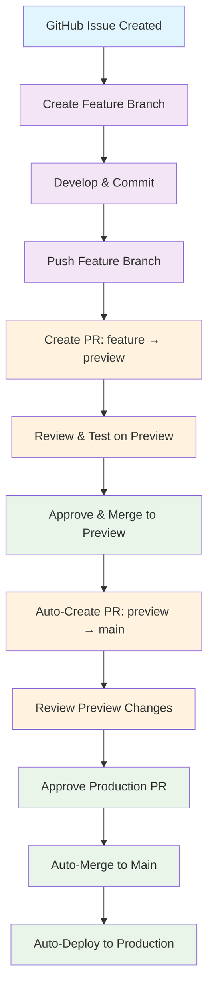

# GitHub Actions CI/CD

This repository includes comprehensive GitHub Actions workflows for automated testing, building, and deployment.

## 🚀 Workflows

### 1. CI/CD Pipeline (`ci-cd.yml`)

**Triggers:** Push to `main`/`preview`, Pull Requests

**Jobs:**

- **Lint & Type Check**: ESLint, TypeScript, Prettier validation
- **Build & Test**: Production build verification
- Uses the shared Node.js/pnpm setup action and repo-pinned versions from `.nvmrc` and `package.json`
- Uses workflow concurrency to cancel stale runs
- Lighthouse performance checks live in `performance-monitor.yml` to avoid duplicate PR runs

### 2. Pull Request Automation (`auto-deploy.yml`)

**Triggers:** Push to `preview` branch, Manual dispatch

**Features:**

- **Auto-Create PR**: Automatically creates PR from preview → main
- **Build Verification**: Runs build check before PR creation
- **Smart Updates**: Updates existing PR instead of creating duplicates
- **Rich PR Description**: Includes build status and deployment info

**Process:**

1. Push to `preview` branch
2. Workflow runs build verification
3. Creates/updates PR with detailed description
4. Ready for review and approval

### 3. Scheduled Deploy (`scheduled-deploy.yml`)

**Triggers:** Weekday schedule, Manual dispatch

**Features:**

- Finds approved auto-deploy PRs from `preview` to `main`
- Runs a build check before merge
- Merges ready deploy PRs and syncs `main` back into `preview`
- Preserves the repository's preview-first deployment flow

### 4. Cleanup Preview (`cleanup-preview.yml`)

**Triggers:** Closed auto-deploy PRs targeting `main`

**Features:**

- Resets `preview` to match `main` after successful production deploys
- Uses `--force-with-lease` for safer preview cleanup
- Comments on the merged deployment PR

### 5. Security Scan (`security-scan.yml`)

**Triggers:** Push, PR, Daily schedule, Manual dispatch

**Features:**

- CodeQL analysis for security vulnerabilities
- Dependency review on PRs
- Scheduled/manual `pnpm audit` reporting without installing dependencies on normal push/PR scans
- Daily security monitoring

### 6. Performance Monitoring (`performance-monitor.yml`)

**Triggers:** Pull request to `preview`, Deployment status (successful `Preview`/`preview` environment)

**Features:**

- Local production-build Lighthouse checks on preview-targeting PRs
- Vercel Preview deployment Lighthouse checks after successful preview deployments
- Core Web Vitals monitoring
- PR comments with performance scores and workflow artifact/report context
- Vercel Preview checks use the `VERCEL_AUTOMATION_BYPASS_SECRET` Actions secret with Vercel Protection Bypass for Automation and the bypass-cookie header so Lighthouse audits the deployed app instead of the Vercel authentication shell
- Lighthouse report uploads use the Lighthouse action `resultsPath` output so HTML/JSON artifacts are collected from the actual generated results directory

### 7. Dependency Updates (`dependabot.yml`)

**Triggers:** Weekly Dependabot schedule

**Features:**

- Grouped production and development dependency update PRs
- GitHub Actions update PRs
- PRs target `preview`
- Removes the need for a custom broad `pnpm update --latest` workflow

### 8. GitHub Actions Lint (`actionlint.yml`)

**Triggers:** Workflow/action changes on push or PR, Manual dispatch

**Features:**

- Runs `actionlint` against workflow files and local actions
- Catches invalid expressions, unknown action inputs, and shell issues before merge

## 🔄 Complete Workflow Guide

### Workflow Diagram



### Development Workflow

1. **Create Feature Branch** (linked to GitHub issue):

   ```bash
   git checkout -b feature/issue-123-add-new-feature
   # Make your changes
   git add .
   git commit -m "Add new feature (closes #123)"
   git push origin feature/issue-123-add-new-feature
   ```

2. **Create PR to Preview**:
   - Create PR from feature branch → preview branch
   - Link to GitHub issue in PR description
   - Review changes and test on preview deployment

3. **Merge to Preview**:
   - Approved PRs merge to preview branch
   - Preview branch gets deployed to Vercel preview URL

4. **Automatic Production PR**:
   - GitHub Actions creates PR from preview → main
   - Build verification runs automatically
   - PR includes detailed description and status

5. **Review & Deploy**:
   - Review the preview changes and approve the PR
   - Approved PR is automatically merged to main
   - Vercel automatically deploys to production

### Branch Strategy

- **`main`**: Production branch, auto-deploys to production
- **`preview`**: Integration branch, auto-creates PRs to main
- **`feature/*`**: Development branches, PR to preview
- **Issue Linking**: Feature branches should reference GitHub issues

### GitHub Issue Integration

**Best Practices:**

1. **Create GitHub Issue First**:
   - Describe the feature/bug fix
   - Add labels (enhancement, bug, etc.)
   - Assign to developer

2. **Branch Naming Convention**:

   ```bash
   feature/issue-123-add-new-feature
   bugfix/issue-456-fix-login-error
   hotfix/issue-789-critical-security-fix
   ```

3. **PR Description Template**:

   ```markdown
   ## Description

   Brief description of changes

   ## Related Issue

   Closes #123

   ## Changes Made

   - List of changes
   - Screenshots if applicable

   ## Testing

   - [ ] Tested locally
   - [ ] Tested on preview deployment
   - [ ] No breaking changes
   ```

4. **Commit Message Format**:
   ```bash
   git commit -m "Add new feature (closes #123)"
   git commit -m "Fix login error (fixes #456)"
   ```

### Workflow Benefits

✅ **Safe Deployments**: Review process prevents bad code from reaching production  
✅ **Automated Testing**: Build verification before every merge  
✅ **Clean History**: Squash merges maintain clean commit history  
✅ **Fast Feedback**: Immediate build status and PR creation  
✅ **Zero Downtime**: Automated deployment with Vercel  
✅ **Issue Tracking**: Clear connection between code and requirements  
✅ **Team Collaboration**: Multiple developers can work on different features

## 🔧 Setup Requirements

### Required Secrets

Add these secrets to your GitHub repository:

```bash
# Vercel Deployment
VERCEL_TOKEN=your_vercel_token
VERCEL_ORG_ID=your_org_id
VERCEL_PROJECT_ID=your_project_id
```

### Getting Vercel Credentials

1. Go to [Vercel Dashboard](https://vercel.com/dashboard)
2. Navigate to your project settings
3. Go to "General" tab
4. Copy the Project ID
5. Go to [Account Settings](https://vercel.com/account/tokens)
6. Create a new token
7. Get your Team ID from the URL or API

## 📊 Performance Thresholds

The workflows enforce these performance standards:

| Metric         | Threshold | Action  |
| -------------- | --------- | ------- |
| Performance    | ≥ 80%     | Warning |
| Accessibility  | ≥ 90%     | Error   |
| Best Practices | ≥ 80%     | Warning |
| SEO            | ≥ 80%     | Warning |
| LCP            | ≤ 4s      | Warning |
| FID            | ≤ 300ms   | Warning |
| CLS            | ≤ 0.1     | Warning |

## 🛠️ Local Development

To run the same checks locally:

```bash
# Install dependencies
pnpm install

# Run linting
pnpm lint

# Type check
pnpm type-check

# Check formatting
pnpm format:check

# Build
pnpm build:ci

# Security audit (reporting workflow also runs this on schedule)
pnpm audit

# Start production build for Lighthouse-style checks
pnpm start:prod
```

## 📈 Monitoring

- **Performance**: Check Lighthouse CI results in workflow logs
- **Security**: Monitor security alerts in GitHub Security tab
- **Dependencies**: Review automated PRs for updates
- **Deployments**: Check Vercel dashboard for deployment status

## 🔄 Workflow Status

All workflows include status badges that you can add to your README:

```markdown


```

## 🚨 Troubleshooting

### Common Issues

1. **Build Failures**: Check Node.js version compatibility
2. **Security Alerts**: Review and update vulnerable dependencies
3. **Performance Regression**: Check Lighthouse CI results
4. **Deployment Issues**: Verify Vercel credentials and project settings

### Getting Help

- Check workflow logs in the Actions tab
- Review GitHub's [Actions documentation](https://docs.github.com/en/actions)
- Check [Vercel's deployment docs](https://vercel.com/docs)
