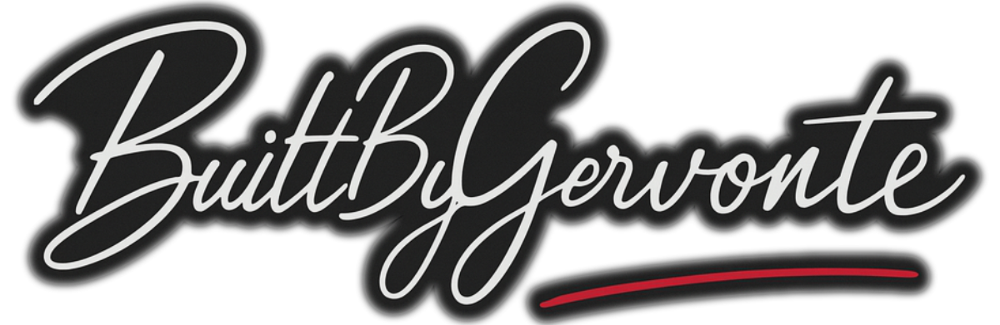

# BuiltByGervonte

Personal portfolio for BuiltByGervonte LLC, featuring software and creative work by Bahamian software engineer and founder Gervonté Fowler.

## Overview

This site highlights:
- active software projects
- professional experience
- technical qualifications
- creative work and product demos

The design uses clean typography, subtle motion, and light/dark themes to keep the experience polished, accessible and easy to navigate.

## Tech Stack

- Next.js
- TypeScript
- Mantine UI
- GitHub Actions
- Vercel
- Lighthouse CI
- Codex for rapid prototyping and development
- Linear for issue management

## Development

```bash
npm install 
npm run dev 
```
Build for production:

```bash 
npm run build 
npm start 
```
## Project Structure

```txt
src/
├── app/
├── components/
├── lib/
├── data/
├── styles/
└── types/

public/
└── images/
```

## Deployment

The site is deployed on Vercel and connected to GitHub for continuous deployment.

## Contact

- Portfolio: https://builtbygervonte.com
- GitHub: https://github.com/gervonte
- Email: hello@builtbygervonte.com

---
<div align="center">
  
</div>
